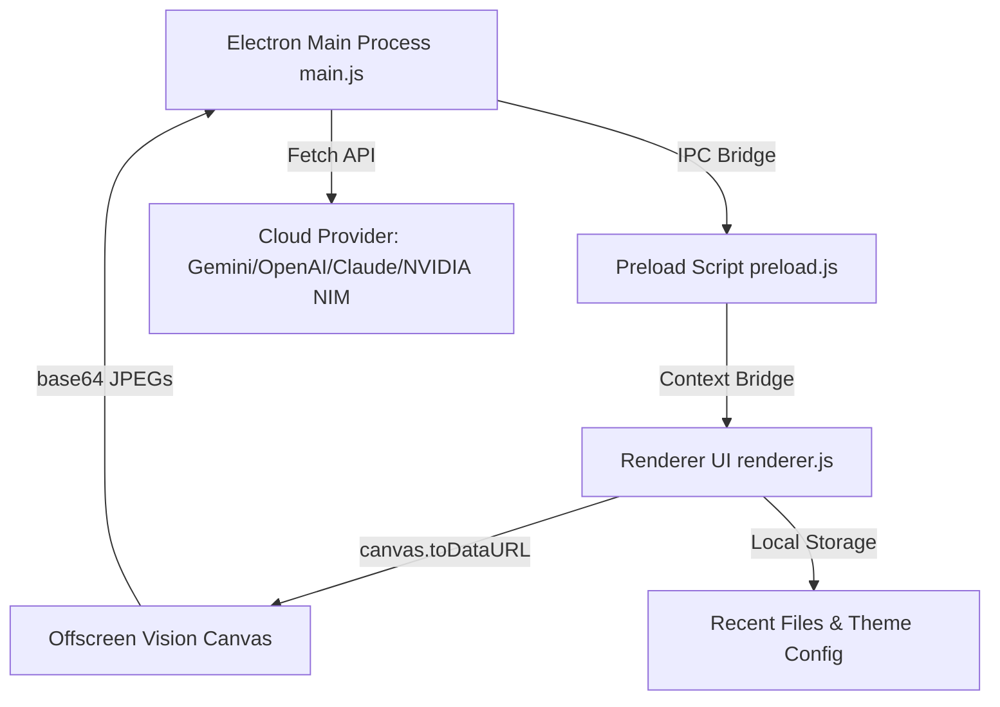

# 👁️ InsightPDF — Desktop AI Document Client

> A premium, Adobe Acrobat-inspired desktop application for interactive PDF reading, dynamic AI summarization, and multimodal visual Q&A chat. Built on Electron, PDF.js, and state-of-the-art LLM providers.

---

## ✨ Features

- 📑 **Tabbed Workspace Routing**: Easily switch between the Home dashboard, Tools directory, and your active PDF document viewport.
- 🎨 **Dual-Theme Design System**: Sleek Light mode (inspired by Acrobat Crimson Red) and Ruby Charcoal Dark mode.
- ⚙️ **Unified AI Gateways**: Built-in support for Google Gemini, OpenAI, Anthropic Claude, Ollama (Local AI), and NVIDIA NIM.
- 🧠 **NVIDIA NIM Reasoning Integrations**: Supports reasoning-thinking budget capabilities for models like `Nemotron 3 Super 120B`.
- 📷 **Multimodal AI Vision fallback**: Scanned document? No problem. InsightPDF automatically renders page canvases into high-resolution visual buffers and uses Vision models (`Llama 3.2 90B Vision Instruct`) to read and chat with your document visually.
- 📂 **Collapsible Sidebar Panes**: Quick sidebar switching between Page Previews (Thumbnails), Outline Bookmarks tree navigation, and In-Document search matching.
- 🚀 **Frameless Window Custom Controls**: Borderless desktop frame with native-like window dragging and custom minimize, maximize, and red-close hover buttons.

---

## 🛠️ Project Structure & Flow



---

## 🚀 Getting Started

### Prerequisites

- [Node.js](https://nodejs.org/) (Version 18 or higher recommended)
- An active API key from your preferred provider (Gemini, OpenAI, Anthropic, or NVIDIA)

### Installation

1. Clone the repository and navigate to the project directory:
   ```bash
   git clone https://github.com/prem573/InsightPDF.git
   cd InsightPDF
   ```

2. Install the node modules:
   ```bash
   npm install
   ```

3. Launch the development application:
   ```bash
   npm run start
   ```

---

## 📦 Packaging & Releases

InsightPDF is equipped with `electron-builder` to compile native packages.

### Local Packaging
To compile the production Windows `.exe` installer locally:
```bash
npm run dist
```
The output installer will be saved in the `/dist` directory.

### CI/CD Releases
A GitHub Actions workflow is configured in `.github/workflows/release.yml`. 
Every push to `main` or push of a version tag (e.g. `v1.0.0`) automatically compiles the Windows package and uploads it directly to your GitHub Releases page.

---

## ⌨️ Shortcuts Reference

| Shortcut | Action |
| --- | --- |
| `Ctrl + O` | Open a local PDF file |
| `Ctrl + +` / `Ctrl + -` | Zoom In / Zoom Out |
| `Ctrl + R` | Reload Renderer Window |
| `Ctrl + Shift + I` | Toggle Developer Tools |
